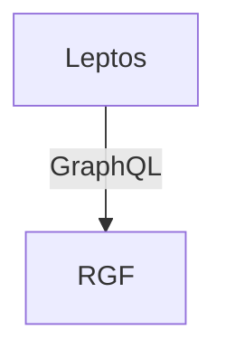
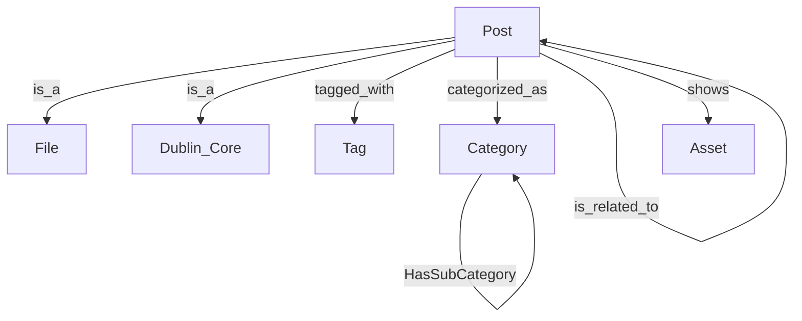

# Graph CMS

## Architecture

## Data Model

### Post

|Namespace|Component|Description|
|---|---|---|
|metadata|[dublin_core](https://github.com/inexorgame/inexor-rgf-plugins/blob/main/plugins/metadata/crates/plugin/types/components/dublin_core.json)|Title, Description, Author, ... |
|file|[file](https://github.com/inexorgame/inexor-rgf-plugins/blob/main/plugins/file/crates/plugin/types/components/file.json)|Filename|

|Property|DataType|Description|
|---|---|---|
|content|string|The content (Markdown)|

|Outbound Entity|Relation|Inbound Entity|
|---|---|---|
|Post|Created_At|[date_time minute](https://github.com/inexorgame/inexor-rgf-plugins/blob/main/plugins/date-time/crates/plugin/types/entities/minute.json)|
|Post|CategorizedAs|[taxonomy categorized_as](https://github.com/inexorgame/inexor-rgf-plugins/blob/main/plugins/taxonomy/crates/plugin/types/relations/categorized_as.json)||
|Post|TaggedWith|[taxonomy tagged_with](https://github.com/inexorgame/inexor-rgf-plugins/blob/main/plugins/taxonomy/crates/plugin/types/relations/tagged_with.json)||
|Post|Related_Post|Post|
|Post|Related_Asset|Asset|

## Persistence

### File based storage

- [ ] The content folder contains markdown files, each represents a post. The filename is the UUID of the post and the file extension is `md`
- [ ] The content folder can be a git repository
- [ ] Additionally a JSON file in the same folder contains the entity instance. The filename is the UUID of the post and the file extension is `json`

### Initialization

- [ ] On startup, the folder will be scanned for JSON and markdown files and entity instances will be created

### Updates in the file system

- [ ] Changing the content of the markdown file results in updating the property content of the entity instance
- [ ] Changing the content of the JSON file results in updating properties of the entity instance (title, description, ...)
- [ ] Deleting the markdown or JSON file results in removing the entity instance from the graph database

### Updates in the graph database

- [ ] Changing the content of the post entity instance results in saving the content to the markdown file and exporting the serialized entity instance to the JSON file
- [ ] Changing the metadata of the post entity instance results in exporting the entity instance to the JSON file

## Editor

- [ ] Show a list of posts
- [ ] Create a new post (Metadata + Markdown Editor)
- [ ] Update a post (Metadata + Markdown Editor)
- [ ] Delete a post

## Renderer

- [ ] Handle URLs
